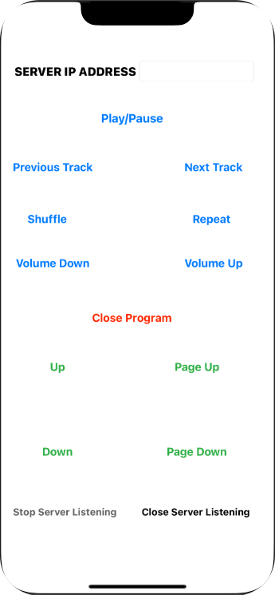

# README #

SPMediaRemoteControllerSwift is an iOS application written in Swift (v. 3.x).    
    
This application is meant to be to be used as a client for the [SPMediaRemoteControllerServer](https://github.com/t0re199/SPMDRMTCTRL_SERVER).     
    
It supports sending media control commands via **TCP Socket**.    

  